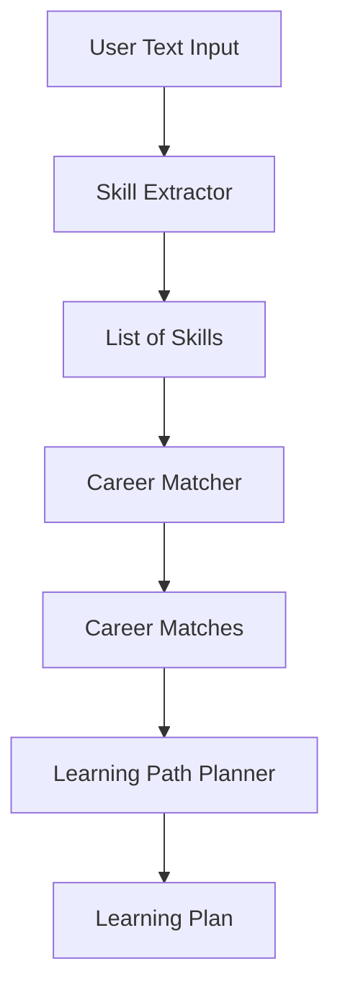

# 🧠 SkillChain AI  
*Originally built in 2022 — now archived for reference.*

SkillChain AI is an early-stage AI-powered tool designed to map user skills to potential career paths, and recommend learning journeys accordingly. The project explored how natural language input can be used to generate actionable career insights through skill inference and rule-based matching.

---

## 📌 Features

- 🧠 **Skill Extractor**: Parses unstructured text to detect technical & soft skills  
- 🧭 **Career Matcher**: Maps skill sets to predefined career tracks  
- 📚 **Learning Path Planner**: Suggests learning objectives to fill skill gaps  
- 🤖 **GPT-3 Demo**: Experimental notebook testing LLM-based skill extraction  
- 🧪 **Test Suite**: Manual test cases simulating key usage scenarios

---

## 🧱 Architecture

> See full architecture in [`docs/architecture.md`](docs/architecture.md)



---

## 👩‍💼 User Scenarios

See example flows in [`docs/user_journey.md`](docs/user_journey.md):

- New graduates
- Mid-career transitions
- Return-to-work after break

---

## 📁 Project Structure

```
skillchain-ai/
├── backend/               ← core logic modules (extraction, matching, planning)
├── data/                  ← static skill taxonomy file
├── docs/                  ← documentation & user journey samples
├── notebooks/             ← GPT demo notebook
├── tests/                 ← simple manual test cases
├── README.md
```

---

## 🚀 Getting Started

> ⚠️ This repo is archived. No further development planned.  
> Still, you can run modules manually:

```bash
python backend/skill_extractor.py
python backend/career_matcher.py
```

To run tests:

```bash
python tests/test_matcher.py
```

---

## 🛠️ Technologies Used

- Python 3.x
- Manual rule-based logic (no dependencies)
- GPT-3 (mocked demo only)
- Markdown documentation
- No frameworks used for testing or deployment

---

## 🗓️ Timeline

- ⏳ Started: Feb 2022  
- 💡 GPT research: Oct 2022  
- 🧪 Final testing: Nov 2022  
- 💤 Archived: Jan 2023

---

## 📄 License

This repository is for educational and archival purposes only.  
All content © 2022 SkillChain AI contributors.

---
# SkillChain AI

🧠 *Originally built in 2022 – now published for archival reference.*

SkillChain AI is an early-stage AI-powered career guidance tool designed to help users map their existing skills to relevant career paths. The system identifies missing competencies, recommends personalized learning journeys, and provides intelligent planning to accelerate professional growth.

## 🔍 What It Does

- 🧩 Extracts **hard & soft skills** from user profiles or uploaded resumes (via GPT-based inference)
- 🧭 Suggests potential **career paths** based on current skills
- 🛠️ Recommends **learning modules** to close skill gaps
- 📈 Builds **personal development chains** toward a career goal

## 🛠️ Tech Stack

- **Backend:** Python, FastAPI
- **Frontend:** React.js (prototype only)
- **Database:** PostgreSQL
- **AI Integration:** OpenAI GPT-3 (used for skill extraction and planning logic)
- **Authentication:** Basic token-based (planned)

## 📁 Project Structure

